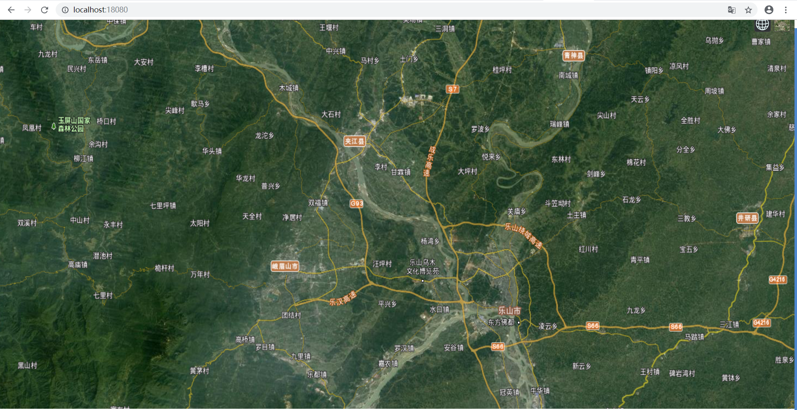

# vue-join-cesium

## Project setup
```
npm install
```

### Compiles and hot-reloads for development
```
npm run serve
```

### Compiles and minifies for production
```
npm run build
```

### Lints and fixes files
```
npm run lint
```

### Customize configuration
See [Configuration Reference](https://cli.vuejs.org/config/).

###### Running effect diagram
<table>
    <tr>
        <td ><center>Preview</center></td>
    </tr>
    </table>

##### Please refer to specific operation  https://blog.csdn.net/qq_34817440/article/details/103587924
